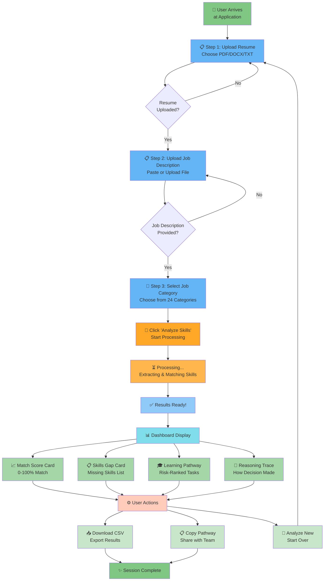

```mermaid
graph LR
    A["📥 INPUT<br/>Resume + Job Description"] --> B["📄 File Processing<br/>Extract Text"]
    
    B --> C["🔍 Skill Extraction<br/>Dual-Mode"]
    
    C --> D["🎯 Keyword-Based<br/>Extraction"]
    C --> E["🤖 LLM-Based<br/>Extraction"]
    
    D --> F["📊 Merge Results<br/>Deduplicate"]
    E --> F
    
    F --> G["🔗 Semantic Matching<br/>Vector Similarity"]
    
    G --> H["⚖️ Gap Analysis<br/>Missing Skills"]
    
    H --> I["⭐ Risk Assessment<br/>Priority Scoring"]
    
    I --> J["📈 Pathway Generation<br/>Risk-Based Ordering"]
    
    J --> K["⏱️ Time Estimation<br/>Learning Hours"]
    
    K --> L["📤 OUTPUT GENERATION"]
    
    L --> M["📊 Dashboard View<br/>Match Score & Gap"]
    L --> N["📋 CSV Export<br/>Detailed Results"]
    L --> O["🧠 Reasoning Trace<br/>Decision Logic"]
    
    style A fill:#c8e6c9
    style B fill:#bbdefb
    style C fill:#ffe0b2
    style D fill:#fff9c4
    style E fill:#fff9c4
    style F fill:#b3e5fc
    style G fill:#e1bee7
    style H fill:#f8bbd0
    style I fill:#ffccbc
    style J fill:#d1c4e9
    style K fill:#c5cae9
    style L fill:#b2dfdb
    style M fill:#a5d6a7
    style N fill:#a5d6a7
    style O fill:#a5d6a7
```

# Presentation Diagrams - AI-Adaptive Onboarding Engine

This guide contains 3 high-quality diagrams for the "Architecture & Workflow" slide of your presentation.

---

## 📊 Diagram 1: System Architecture

**Title:** System Architecture - AI-Adaptive Onboarding Engine

**Description:** 
Shows all major components:
- Frontend Layer (Web UI)
- Backend Layer (Flask Server)
- Processing Layer (Extractors & Analyzers)
- AI/ML Models (Transformers, Semantic Matching)
- Output Generation (Visualization, Export)

**How to create JPEG:**

### Option A: Online Mermaid Editor (Easiest)
1. Go to: https://mermaid.live/
2. Paste the Mermaid code from below
3. Click "Export" → "Download as SVG/PNG/JPEG"

### Option B: Using Local Tools
```bash
# Install mermaid-cli (if you have Node.js)
npm install -g @mermaid-js/mermaid-cli

# Create JPEG from markdown
mmdc -i diagram.mmd -o diagram.jpeg -t dark
```

### Option C: VS Code Extension
1. Install "Markdown Preview Mermaid" extension
2. Open markdown file with diagram
3. Right-click → "Open Preview"
4. Screenshot the diagram

---

## 🖼️ Diagram 1: System Architecture (Mermaid Code)

```mermaid
graph TB
    subgraph Frontend["🎨 Frontend Layer"]
        UI["Web UI<br/>HTML/CSS/JS"]
        FileUpload["📄 File Upload<br/>Resume • Job Desc"]
        Results["📊 Results Display<br/>Dashboard"]
    end
    
    subgraph Backend["⚙️ Backend Layer"]
        Flask["Flask Server<br/>Port 5000"]
        Processor["Request Processor<br/>Route Handler"]
    end
    
    subgraph Processing["🧠 Processing Layer"]
        Resume["Resume Extractor<br/>PDF/DOCX/TXT"]
        JobDesc["Job Description<br/>Parser"]
        SkillExt["Skill Extraction<br/>Keyword + LLM"]
        GapAnalyzer["Gap Analyzer<br/>Risk Assessment"]
    end
    
    subgraph Models["🤖 AI/ML Models"]
        SentenceTransformer["sentence-transformers<br/>Semantic Matching"]
        Transformers["transformers<br/>NLP Pipeline"]
        Catalog["Job Category<br/>Catalog 24x"]
    end
    
    subgraph Output["📈 Output Generation"]
        PathwayGen["Pathway Generator<br/>Risk-Based Ordering"]
        Visualization["Visualization<br/>Charts & Graphs"]
        CSV["CSV Export<br/>Results File"]
    end
    
    UI -->|Upload Files| FileUpload
    FileUpload -->|Send Data| Flask
    Flask -->|Route Request| Processor
    Processor -->|Extract Resume| Resume
    Processor -->|Parse Description| JobDesc
    Resume -->|Text Data| SkillExt
    JobDesc -->|Job Info| SkillExt
    SkillExt -->|Skills | Gap Analysis| GapAnalyzer
    GapAnalyzer -->|Semantic Matching| SentenceTransformer
    GapAnalyzer -->|NLP Processing| Transformers
    SentenceTransformer -->|Job Match| Catalog
    GapAnalyzer -->|Generate Pathway| PathwayGen
    PathwayGen -->|Ranking| Visualization
    Visualization -->|Format Output| CSV
    Visualization -->|Display Results| Results
    CSV -->|Download| Results
    
    style Frontend fill:#e1f5ff
    style Backend fill:#fff3e0
    style Processing fill:#f3e5f5
    style Models fill:#e8f5e9
    style Output fill:#fce4ec
```

---

## 🖼️ Diagram 2: Data Flow

**Title:** Data Flow - Input to Output Processing

**Description:**
Shows how data moves through the system from inputs to outputs:
1. Resume + Job Description Input
2. Text Extraction & Processing
3. Dual-mode Skill Extraction (Keyword + LLM)
4. Semantic Matching & Gap Analysis
5. Risk Assessment & Pathway Generation
6. Output visualization and export



---

## 🖼️ Diagram 3: UI/UX Logic

**Title:** UI/UX Logic - User Journey & Interaction Flow

**Description:**
Complete user journey from landing on the application to getting results:
1. Welcome screen
2. Resume upload
3. Job description upload
4. Job category selection
5. Analysis trigger
6. Processing display
7. Results dashboard with 4 cards
8. Export/Share/Retry actions



---

## 🎯 Quick JPEG Conversion Method

**Easiest way (No installation):**

1. **Go to:** https://mermaid.live/
2. **Copy-paste each diagram code** (above)
3. **Click the "Export" button** in the top-right
4. **Select "Download as PNG"** or **"Download as SVG"**
5. **Convert to JPEG** (optional):
   - Right-click image → Open with Image Editor
   - File → Export as JPEG

---

## 🖼️ Diagram Specifications for Presentation

| Aspect | Specification |
|--------|---------------|
| **Format** | JPEG (High Quality) |
| **Resolution** | 1920x1080 or higher |
| **Color Theme** | Light (as shown above) |
| **Aspect Ratio** | 16:9 (Standard presentation) |
| **DPI** | 300 DPI (Print quality) |
| **File Size** | < 2 MB each |

---

## 📋 How to Use in PowerPoint/Google Slides

1. **Create your presentation** with 5 slides
   - Slide 1: Solution Overview
   - Slide 2: Architecture & Workflow (with all 3 diagrams)
   - Slide 3: Tech Stack & Models
   - Slide 4: Algorithms & Methodology
   - Slide 5: Results & Metrics

2. **Insert Diagram Images:**
   - In PowerPoint: Insert → Pictures → Select JPEG
   - In Google Slides: Insert → Image → Upload your diagram JPEGs

3. **Size the diagrams:**
   - Each diagram takes ~1/3 of the slide
   - Or use one diagram per section

4. **Add captions:**
   - System Architecture: "5-layer modular design"
   - Data Flow: "End-to-end processing pipeline"
   - UI/UX Logic: "Intuitive 3-step user journey"

---

## 💡 Pro Tips

✅ **DO:**
- Use high-quality JPEG for presentations
- Keep margins around each diagram
- Add title above each diagram
- Use consistent color theme

❌ **DON'T:**
- Use low resolution images (< 1280x720)
- Mix light and dark themes
- Overcrowd the slide with too many diagrams
- Use white background for projection (hard to see)

---

## 🎨 Alternative Tools to Create JPEG

If you want to edit or regenerate diagrams:

| Tool | Cost | Ease |
|------|------|------|
| Mermaid Live | Free | ⭐⭐⭐⭐⭐ |
| Lucidchart | Paid | ⭐⭐⭐⭐ |
| Draw.io | Free | ⭐⭐⭐⭐ |
| Figma | Freemium | ⭐⭐⭐ |
| Canva | Freemium | ⭐⭐⭐⭐ |

---

## 📞 Support

If diagrams don't render correctly:
1. Check Mermaid syntax at: https://mermaid.js.org/syntax/
2. Try a different browser
3. Clear cache and refresh
4. Use "View in Full Page" option

---

**Created:** March 2026
**Project:** AI-Adaptive Onboarding Engine
**For:** ARTPARK CodeForge Hackathon Presentation
