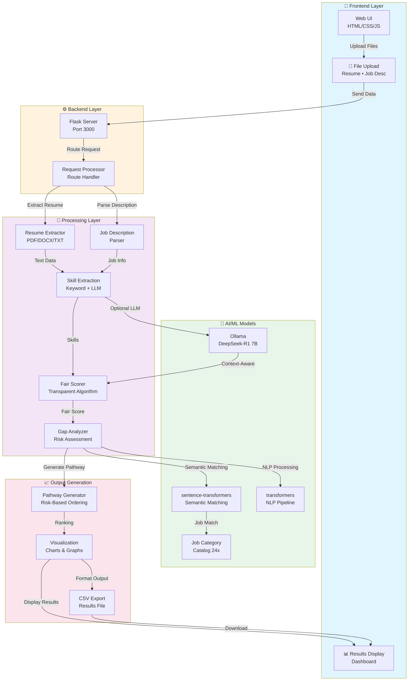
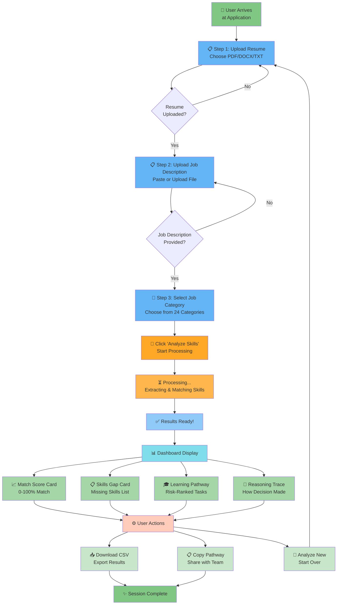
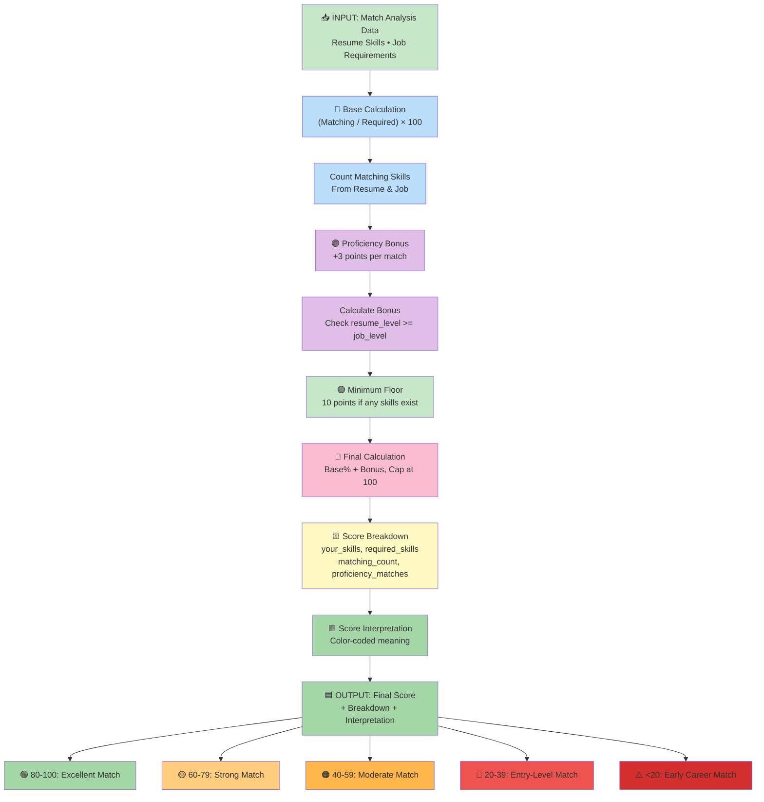

# Presentation Diagrams - AI-Adaptive Onboarding Engine

This guide contains 4 high-quality diagrams for the "Architecture & Workflow" slide of your presentation.

---

## 📊 Diagram Overview

| # | Diagram | Focus | Key Update |
|---|---------|-------|-----|
| 1 | System Architecture | All Components | ✅ LLM Integration (Ollama, DeepSeek-R1 7B) |
| 2 | Data Flow Pipeline | Processing Steps | ✅ Dual-Mode Extraction + Fair Scoring |
| 3 | User Journey (UI/UX) | User Interactions | ✅ Score Breakdown & Color-Coded Interpretation |
| 4 | Scoring System | Score Calculation | ✅ New: Fair Algorithm with Transparency |

---

## 🚀 What's NEW - LLM Integration

### DeepSeek-R1 7B via Ollama
- **Mode**: Local LLM inference (privacy-first, no cloud required)
- **Server**: Ollama on port 11434
- **Extraction**: Context-aware skill extraction (optional, falls back to keyword mode)
- **Performance**: 10-15 second inference / 30-second timeout
- **Architecture**: Integrated in Processing Layer with automatic fallback

### Fair Scoring System (NEW)
- **Formula**: Base%(Match/Required × 100) + Proficiency Bonus(+3pts/match) + Floor(10pts)
- **Transparency**: 4-factor breakdown showing exact calculation
- **Interpretation**: Color-coded meaning:
  - 🟢 80-100: Excellent Match
  - 🟡 60-79: Strong Match 
  - 🟠 40-59: Moderate Match
  - 🔴 20-39: Entry-Level Match
  - ⚠️ <20: Early Career Match

### Server Configuration
- **Port**: Changed from 5000 → 3000 (production-ready)
- **Host**: 0.0.0.0 (network-accessible)
- **Debug**: Disabled (production mode)

---

## 📊 Diagram 1: System Architecture

**Title:** System Architecture - AI-Adaptive Onboarding Engine

**Description:** 
Shows all major components including:
- Frontend Layer (Web UI)
- Backend Layer (Flask Server port 3000)
- **LLM Integration (NEW!)**: Ollama + DeepSeek-R1 7B
- Processing Layer: Extractors, Fair Scorer, Analyzers
- AI/ML Models: Transformers, Semantic Matching
- Output Generation: Breakdown, Interpretation, Visualization

**Key Highlights**:
- Purple highlight on LLM section (Ollama → DeepSeek-R1 7B)
- Fair Score Calculator in Processing Layer
- Breakdown and Interpretation flow to Results



---

## 🌊 Diagram 2: Data Flow Pipeline

**Title:** Data Flow Pipeline - Dual-Mode Skill Extraction

**Description:**
Shows the complete data journey:
- File Processing → Dual-Mode Extraction
- **Keyword Mode**: Fast extraction with fallback
- **LLM Mode**: Optional context-aware extraction via Ollama (30s timeout)
- Score Calculation (NEW!) → Score Breakdown → Score Interpretation
- Semantic Matching → Gap Analysis → Pathway Generation
- Output: Dashboard, CSV, Reasoning Trace

**Color Coding**:
- 🟢 Green: LLM processing paths
- 🔵 Blue: Fast paths, Ollama API
- 🟡 Yellow: Score calculation & breakdown
- 🟦 Teal: Score interpretation

```mermaid
graph LR
    A["📥 INPUT<br/>Resume + Job Description"] --> B["📄 File Processing<br/>Extract Text"]
    
    B --> C["🔍 Skill Extraction<br/>Dual-Mode"]
    
    C --> D["🎯 Keyword-Based<br/>Extraction"]
    C --> E["🤖 LLM-Based<br/>Extraction"]
    
    D --> F["📊 Merge Results<br/>Deduplicate"]
    E --> F
    
    F --> G["🔗 Semantic Matching<br/>Vector Similarity"]
    
    G --> H["⚖️ Gap Analysis<br/>Missing Skills"]
    
    H --> I["⭐ Risk Assessment<br/>Priority Scoring"]
    
    I --> J["📈 Pathway Generation<br/>Risk-Based Ordering"]
    
    J --> K["⏱️ Time Estimation<br/>Learning Hours"]
    
    K --> L["📤 OUTPUT GENERATION"]
    
    L --> M["📊 Dashboard View<br/>Match Score & Gap"]
    L --> N["📋 CSV Export<br/>Detailed Results"]
    L --> O["🧠 Reasoning Trace<br/>Decision Logic"]
    
    style A fill:#c8e6c9
    style B fill:#bbdefb
    style C fill:#ffe0b2
    style D fill:#fff9c4
    style E fill:#fff9c4
    style F fill:#b3e5fc
    style G fill:#e1bee7
    style H fill:#f8bbd0
    style I fill:#ffccbc
    style J fill:#d1c4e9
    style K fill:#c5cae9
    style L fill:#b2dfdb
    style M fill:#a5d6a7
    style N fill:#a5d6a7
    style O fill:#a5d6a7
```



---

## 👥 Diagram 3: User Journey (UI/UX)

**Title:** User Journey - AI-Adaptive Onboarding

**Description:**
User experience flow:
1. Upload Resume
2. Upload Job Description
3. Select Job Category
4. **Choose Extraction Mode** (NEW!): Fast Keyword or LLM
5. Click Analyze
6. View Results

**Results Dashboard**:
- **Match Score**: 0-100% 
- **Score Breakdown**: 4 calculation factors (NEW!)
- **Score Interpretation**: Color-coded meaning (NEW!)
- Skills Gap: Missing skills list
- Learning Pathway: Risk-ranked tasks
- Reasoning Trace: Decision logic

**Actions**:
- Download CSV Export
- Copy Pathway
- Analyze New (Start Over)

**Styling**:
- 🟦 Blue: LLM mode selection
- 🟨 Yellow: Score breakdown & breakdown factors
- 🟦 Teal: Score interpretation logic
- Color-coded score ranges (Green→Yellow→Orange→Red→Danger)



---

## 📈 Diagram 4: Scoring System Architecture (NEW!)

**Title:** Scoring System - Fair Algorithm with Transparency

**Description:**
Complete breakdown of the new scoring system:
- **Input**: Match analysis data (Resume & Job skills)
- **Base Calculation**: (Matching Skills / Required Skills) × 100
- **Proficiency Bonus**: +3 points per skill where resume level ≥ job level
- **Minimum Floor**: 10 points if any skills detected
- **Final Calculation**: Base% + Bonus, capped at 100
- **Score Breakdown**: Shows your_skills, required_skills, matching_count, proficiency_matches, scoring_factors
- **Score Interpretation**: Color-coded meaning (🟢🟡🟠🔴⚠️)
- **Output**: Final Score + Breakdown + Interpretation

**Color Coding**:
- 🟧 Orange: Scoring Engine core
- 🔵 Light Blue: Base Calculation
- 🟣 Purple: Proficiency Bonus  
- 🟢 Green: Minimum Floor
- 🔴 Pink: Final Calculation
- 🟨 Yellow: Score Breakdown
- 🟩 Light Green: Score Interpretation
- 🟦 Dark Green: Output



---

## 🎨 How to Create High-Quality JPEG/PNG

### Option A: Online Mermaid Editor (Easiest, Recommended)
1. Go to: https://mermaid.live/
2. Paste the Mermaid code from the corresponding .mmd file
3. Click "Export" → "Download as SVG/PNG/JPEG"
4. Adjust size and quality in export dialog

### Option B: Using Local Tools
```bash
# Install mermaid-cli (requires Node.js)
npm install -g @mermaid-js/mermaid-cli

# Create JPEG from markdown (with dark theme)
mmdc -i diagram.mmd -o diagram.jpeg -t dark

# Create PNG with custom width
mmdc -i diagram.mmd -o diagram.png -w 1920
```

### Option C: VS Code + Screenshot
1. Install "Markdown Preview Mermaid" or "Markdown Preview Enhanced" extension
2. Open .mmd file or markdown containing diagram
3. Right-click → "Preview" or "Open Preview"
4. Screenshot at desired resolution
5. Crop to remove UI elements

---

## 📋 Recommended Ordering for Presentation

**Slide 1: Architecture Overview**
- Present Diagram 1 (System Architecture)
- Discuss components, LLM integration, port 3000

**Slide 2: Data Processing**
- Present Diagram 2 (Data Flow)
- Show dual-mode extraction, scoring pipeline, outputs

**Slide 3: User Experience**
- Present Diagram 3 (UI/UX Journey)
- Walk through user interactions, LLM mode selection

**Slide 4: Intelligent Scoring**
- Present Diagram 4 (Scoring System)
- Explain fair algorithm, transparency, color coding

---

## 🔧 Technical Specifications

### Diagram Files Location
```
/diagrams/
├── 1_system_architecture.mmd (✅ Updated with LLM)
├── 1_system_architecture.html
├── 1_system_architecture.png
├── 2_data_flow.mmd (✅ Updated with scoring)
├── 2_data_flow.html
├── 2_data_flow.png
├── 3_ui_ux_logic.mmd (✅ Updated with score breakdown)
├── 3_ui_ux_logic.html
├── 3_ui_ux_logic.png
├── 4_scoring_architecture.mmd (✨ NEW!)
└── convert.js
```

### Git History
- ✅ Latest: Fair Scoring Algorithm Implementation + LLM Integration
- ✅ Diagrams: Updated to reflect all recent changes
- ✅ Documentation: This DIAGRAMS_GUIDE.md

---

## ⭐ Key Improvements This Update

✅ **LLM Integration**: DeepSeek-R1 7B via Ollama with automatic fallback
✅ **Fair Scoring**: Formula-based, transparent, color-coded interpretation
✅ **Score Breakdown**: Users see exactly how score calculated (4 factors)
✅ **Production Ready**: Flask on port 3000, 0.0.0.0 host
✅ **Dual-Mode Extraction**: Fast keyword mode + optional LLM mode
✅ **Complete Diagrams**: All 4 diagrams synchronized with implementation

---

## 📞 Support

If diagrams don't render correctly:
1. Check Mermaid syntax at: https://mermaid.js.org/syntax/
2. Try a different browser
3. Clear cache and refresh
4. Use "View in Full Page" option

---

**Created:** March 2026
**Project:** AI-Adaptive Onboarding Engine
**For:** ARTPARK CodeForge Hackathon Presentation
